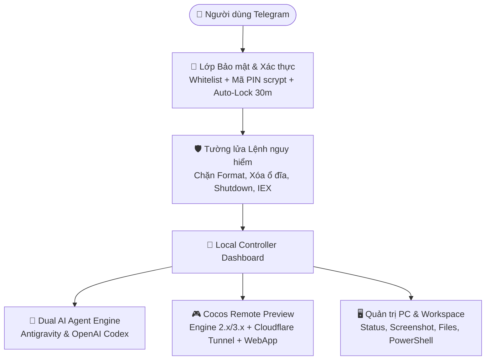

# 🤖 Dual Agent, Cocos Creator Preview & Secure Local Controller

Ứng dụng Telegram Bot chuyên nghiệp giúp bạn **lập trình AI từ xa (Google Antigravity & OpenAI Codex)**, **chơi và kiểm thử game Cocos Creator trực tiếp trên điện thoại (Telegram Web App)**, và **quản trị hệ thống máy tính** với kiến trúc **bảo mật đa lớp an toàn tuyệt đối**.

---

## 🌟 Tính năng nổi bật



### 1. 🔐 Bảo mật 2 Lớp & Tự động Khóa (Security First)
- **Tầng 1 (Telegram Whitelist):** Chỉ cho phép các Telegram User ID được khai báo trong file `.env`. Người lạ sẽ bị từ chối ngay lập tức (Anti-enumeration).
- **Tầng 2 (Mã PIN scrypt):** Yêu cầu nhập mã PIN bảo mật để chuyển từ trạng thái `LOCKED` sang `AUTHENTICATED`.
- **Mã hóa scrypt an toàn:** Tuyệt đối không lưu PIN plaintext. PIN được băm với Salt ngẫu nhiên 16 bytes.
- **Chống Brute-force:** Tự động tạm khóa 5 phút nếu nhập sai mã PIN 5 lần liên tiếp.
- **⏱️ Tự động khóa sau 30 phút không hoạt động (Inactivity Auto-Lock):** Nếu sau 30 phút bạn không gửi tin nhắn hay thao tác nào, bot sẽ tự động khóa lại để phòng ngừa người khác cầm điện thoại của bạn.
- **Khóa 1-chạm:** Gõ `/lock` hoặc bấm nút **`[ 🔒 Khóa Controller ]`** để khóa ngay lập tức.
- **Lưu trữ an toàn trong RAM:** Trạng thái đăng nhập không lưu xuống ổ đĩa. Khi khởi động lại máy tính hoặc bot, hệ thống luôn tự động quay về trạng thái `LOCKED`.

---

### 2. 🛡️ Tường lửa Chặn Lệnh Nguy Hiểm (Command Safety Firewall)
- **Chặn tuyệt đối các lệnh format và phá hoại ổ đĩa:** `format`, `diskpart`, `Format-Volume`, `clear-disk`, `remove-partition`, `vssadmin delete shadows`...
- **Chặn xóa đệ quy toàn bộ ổ đĩa:** `rm -rf /`, `rmdir /s /q C:\`, `rd /s /q C:\Windows`, `del /f /s /q *.*`...
- **Chặn can thiệp Registry hệ thống:** `reg delete HKLM`, `Remove-ItemProperty HKLM:`...
- **Chặn tắt máy / sập máy:** `shutdown`, `Stop-Computer`, `taskkill /im svchost.exe`...
- **Chặn tải mã độc từ xa:** `irm | iex`, `curl | bash`, `Invoke-Expression`...
- **Ràng buộc an toàn cho AI:** Tự động tiêm `SYSTEM SAFETY CONSTRAINT` vào ngữ cảnh của cả Google Antigravity và OpenAI Codex để AI chỉ làm việc trong thư mục dự án và không bao giờ thực hiện các lệnh phá hoại.

---

### 3. 🎮 Cocos Creator Remote Preview (Chơi game từ xa qua Telegram)
- **Tự động nhận diện Engine:** Tự động phát hiện dự án **Cocos Creator 2.x và 3.x** (`project.json`, `package.json`).
- **Tự động tìm đường dẫn Engine:** Quét và tìm thấy các phiên bản `CocosCreator.exe` đã cài đặt trên máy tính (hỗ trợ 2.3.4, 2.4.4, 3.0.0, 3.8.6...).
- **Khởi động Preview Server:** Tự động mở server preview (Port `7456`) và thực hiện HTTP Health Check.
- **Cloudflare Tunnel (HTTPS) an toàn:** Tự động tạo đường truyền HTTPS tốc độ cao mà **không cần mở cổng modem/router** và **chỉ forward duy nhất cổng game**, không mở cổng PC ra ngoài.
- **📱 Nút `🎮 OPEN PREVIEW` (Telegram Web App):** Chơi game mượt mà trực tiếp ngay trong ứng dụng Telegram trên điện thoại.
- **Hỗ trợ WebSocket / Hot Reload:** Đồng bộ mã nguồn thời gian thực khi AI sửa code game.
- **Nút `🔄 RESTART` & `⏹ STOP`:** Dọn dẹp tiến trình an toàn khi dừng hoặc khởi động lại.

---

### 4. 🤖 Hỗ trợ 2 AI Agent độc lập (Dual Engine)
- **🤖 Google Antigravity:** Gemini 3.7 Flash, Gemini 3.1 Pro, Claude Sonnet 4.6, Claude Opus 4.6 (Thinking), chế độ Accept-Edits và Plan.
- **⚡ OpenAI Codex:** GPT-5.6 Terra, OpenAI o3, o3-mini, GPT-4.1, Reasoning Effort (Low, Medium, High), Elevated Sandbox & MCP Tools.
- **Chuyển đổi tức thì:** Đổi giữa 2 Engine bất kỳ lúc nào với lệnh `/agent` hoặc qua menu Telegram.

---

### 5. 👤 Quản lý Thông tin Tài khoản AI Tự động
- Tự động nhận diện Email, Tên chủ tài khoản, Gói cước (Free, Plus, Pro, Consumer) của cả 2 Engine qua Windows Credential Manager (`gemini:antigravity`) và `~/.codex/auth.json`.
- Cơ chế **Multi-tier Fallback 4 tầng** đảm bảo không bao giờ bị mất thông tin tài khoản.
- Xem chi tiết qua lệnh `/account` hoặc nút **`[ 👤 Tài khoản AI ]`**.

---

### 6. 📁 Quản lý Workspace & File Explorer
- Tự động nhận diện các thư mục dự án đã mở từ Antigravity (`settings.json`) và Codex (`config.toml`).
- Đổi thư mục làm việc nhanh chóng với `/workspace` hoặc `/cd <đường_dẫn>`.
- Xem danh sách tệp (`/ls`) và đọc trực tiếp mã nguồn (`/view <file>`) ngay trên Telegram.
- Tải tệp/ảnh từ điện thoại lên PC trực tiếp vào thư mục dự án.

---

### 7. 🖥️ Giám sát Hệ thống PC & Chụp Màn Hình
- `/status`: Kiểm tra mức sử dụng CPU, RAM, dung lượng các ổ đĩa (C:, D:, E:...), Uptime máy tính và Agent hiện tại.
- `/screenshot`: Chụp ảnh màn hình máy tính gửi về Telegram theo thời gian thực.
- `/cmd <lệnh>`: Thực thi các lệnh PowerShell an toàn (được bảo vệ bởi Security Guard).

---

## 🚀 Hướng dẫn Cài đặt & Khởi chạy (Chỉ 2 phút)

### Bước 1: TẠO BOT TELEGRAM 
Mở Telegram và tìm: @BotFather
BotFather là bot chính thức dùng để tạo và quản lý Telegram Bot: /newbot
BotFather sẽ hỏi: Alright, a new bot. How are we going to call it?
Nhập tên hiển thị, Ví dụ: Antigravity Controller
Sau đó BotFather yêu cầu username, Ví dụ: antigravity_controller_bot
Sau khi tạo thành công, BotFather trả về một Token_Telegram_Của_Bạn dạng: 1234567890:AAxxxxxxxxxxxxxxxxxxxxxxxxxxxxxxxxxxx
Nhắn 1 tin nhắn bất kỳ để bot trả lời lại với thông tin chứa ID_Telegram_Của_Bạn, có dạng: 1234567890


###


### Bước 2: Cấu hình file [`.env`](file:///E:/TELEGRAM_BOT/CocosDevBot/.env)
Mở file [`.env`](file:///E:/TELEGRAM_BOT/CocosDevBot/.env) trong thư mục `E:\TELEGRAM_BOT\CocosDevBot\` và cập nhật:
```env
TELEGRAM_BOT_TOKEN=Token_Telegram_Của_Bạn
ALLOWED_USER_IDS=ID_Telegram_Của_Bạn
DEFAULT_AGENT=antigravity # hoặc codex
AUTH_AUTO_LOCK_MINUTES=30

```

> 💡 **Cách tạo mã PIN bảo mật mới:**
> Mở PowerShell tại thư mục dự án và chạy:
> ```powershell
> python auth_manager.py --set-pin <mã_pin_của_bạn>
> ```
> Sao chép dòng `AUTH_PIN_HASH=...` được sinh ra và dán vào file [`.env`](file:///E:/TELEGRAM_BOT/CocosDevBot/.env). (Mặc định mã PIN khởi tạo là `123456`).

---

### Bước 3: Khởi động Bot
- **Cách 1 (Cửa sổ dòng lệnh):** Nhấp đúp chuột vào file [`start_bot.bat`](file:///E:/TELEGRAM_BOT/CocosDevBot/start_bot.bat).
- **Cách 2 (Chạy ngầm dưới nền Windows):** Nhấp đúp chuột vào file [`start_bot_background.vbs`](file:///E:/TELEGRAM_BOT/CocosDevBot/start_bot_background.vbs).
- **Tắt bot:** Nhấp đúp chuột vào file [`stop_bot.bat`](file:///E:/TELEGRAM_BOT/CocosDevBot/stop_bot.bat).

---

## 📱 Danh sách Lệnh điều khiển trên Telegram

| Lệnh | Chức năng |
| :--- | :--- |
| **Nhắn tin trực tiếp** | Gửi yêu cầu lập trình / sửa bug cho AI Agent (hoặc gửi PIN để mở khóa nếu đang LOCKED) |
| `/start` | Mở bảng điều khiển và menu phím tắt |
| `/lock` hoặc `/logout` | **Khóa ngay lập tức** bảng điều khiển |
| `/unlock [pin]` | Mở khóa Controller bằng mã PIN |
| `/preview` hoặc `/cocos` | Mở bảng điều khiển **Cocos Creator Preview** |
| `/agent` | Chuyển đổi giữa **🤖 Google Antigravity** và **⚡ OpenAI Codex** |
| `/account` | Xem chi tiết thông tin tài khoản AI (Email, Gói cước Free/Pro/Plus) |
| `/model` | Cấu hình Model AI (Gemini, Claude, GPT, o3...) và Reasoning Effort |
| `/workspace` hoặc `/ws` | Xem và chọn nhanh thư mục dự án làm việc |
| `/cd <đường_dẫn>` | Chuyển thư mục làm việc sang đường dẫn bất kỳ trên PC |
| `/ls [thư mục]` | Liệt kê danh sách các file/thư mục con |
| `/view <file>` | Đọc nội dung file code ngay trên Telegram |
| `/status` | Xem thông số CPU, RAM, Ổ đĩa, Uptime PC và tài khoản |
| `/screenshot` | Chụp màn hình máy tính gửi về Telegram |
| `/cmd <lệnh>` | Chạy lệnh PowerShell an toàn trực tiếp trên máy |
| `/stop` | Hủy tác vụ AI đang chạy dở |
| `/new` hoặc `/reset` | Xóa ngữ cảnh cũ và bắt đầu phiên trò chuyện AI mới |
| `/help` | Xem hướng dẫn chi tiết các lệnh |

---

## 🛠️ Cấu trúc Thư mục Mã nguồn

```
E:\TELEGRAM_BOT\CocosDevBot\
├── bot.py                     # Chương trình chính Telegram Bot & Authorization Middleware
├── auth_manager.py            # Quản lý Xác thực đa lớp, mã hóa scrypt, Rate Limit & Auto-Lock
├── security_guard.py          # Tường lửa kiểm soát lệnh nguy hiểm (Chặn Format, Wiping, IEX...)
├── cocos_preview_manager.py   # Bộ điều khiển vòng đời Cocos Preview & Cloudflare Tunnel
├── cocos_detector.py          # Tự động nhận diện dự án Cocos 2.x/3.x & Vị trí cài Engine
├── cloudflare_tunnel_manager.py # Quản lý tiến trình Cloudflare Tunnel (cloudflared)
├── agent_manager.py           # Bộ điều phối trung tâm quản lý Antigravity & OpenAI Codex
├── account_manager.py         # Quản lý & trích xuất Email, Plan, Tier tài khoản AI (Multi-tier)
├── antigravity_runner.py      # Module điều khiển Google Antigravity CLI (agy)
├── codex_runner.py            # Module điều khiển OpenAI Codex CLI (codex)
├── workspace_manager.py       # Tự động nhận diện dự án từ settings Antigravity & Codex
├── system_utils.py            # Giám sát phần cứng PC, chụp màn hình, chạy PowerShell
├── config.py                  # Quản lý cấu hình & phát hiện đường dẫn binary tự động
├── requirements.txt           # Danh sách thư viện Python
├── .env                       # File cấu hình Token, User ID, PIN Hash bảo mật
├── .env.example               # Mẫu cấu hình chuẩn
├── start_bot.bat              # File khởi động nhanh 1-click cho Windows
├── start_bot_background.vbs   # File khởi động chạy ngầm dưới nền
└── stop_bot.bat               # File đóng và dừng toàn bộ tiến trình bot an toàn
```
